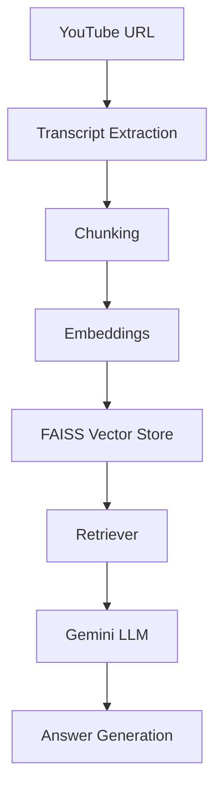

# TranscriptIQ

AI-powered YouTube video question-answering system using Retrieval-Augmented Generation (RAG).

## Features
- YouTube transcript extraction
- Semantic search using embeddings
- FAISS vector database
- Gemini-powered conversational QA
- Streamlit chat interface

## Architecture


## Tech Stack
- Python
- LangChain
- FAISS
- HuggingFace Embeddings
- Gemini API
- Streamlit

## How It Works
1. Extract transcript
2. Chunk text
3. Generate embeddings
4. Store vectors in FAISS
5. Retrieve relevant chunks
6. Generate grounded response using Gemini

## Chunking Rationale
- `chunk_size=1200`: balances retrieval precision and semantic completeness for spoken transcript text.
- `chunk_overlap=200`: preserves continuity across adjacent transcript segments so boundary facts are not lost.

## Challenges Faced
- Transcript noise
- Chunk overlap tuning
- Hallucination reduction
- Retrieval relevance optimization

## Future Improvements
- Multi-video support
- Playlist ingestion
- Chat memory
- Citation support with richer timestamp mapping
- PDF + YouTube hybrid RAG

## Setup
1. Create environment and install dependencies:
   ```bash
   uv venv
   uv pip install -r requirements.txt
   ```
2. Add API key in `.env`:
   ```env
   GOOGLE_API_KEY=your_key_here
   ```
3. Run the app:
   ```bash
   cd src
   streamlit run app.py
   ```

## Live Demo
_Add your Streamlit Cloud / HuggingFace Spaces / Render deployment URL here._
